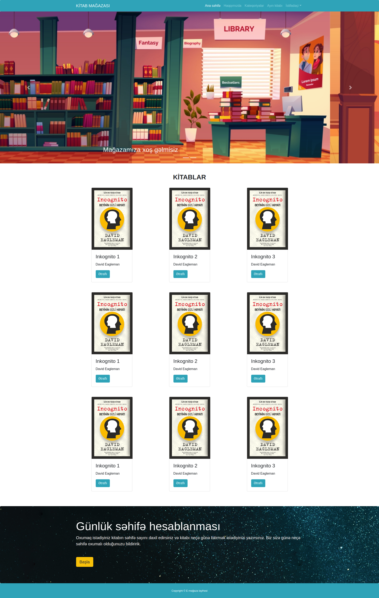
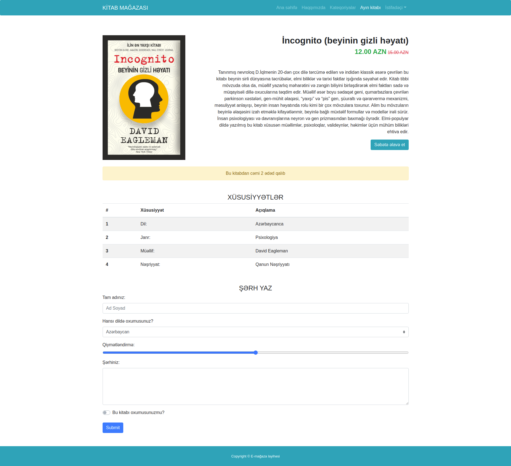

## E-commerce website

### 8.day tasks

#### In today's tasks, using only Bootstrap classes, the product page and homepage will be improved.

#### Home Tasks
* The menu part should be more compact, not full screen. (Bootstrap container class)
* Book cards should be 9 pieces and lined up 3-3. (Bootstrap row, col)
* This part should not be full screen either. (Container)
* Jumbotron part should be made as shown in the picture and should be container.

#### Product Page Tasks
* All parts on the page must be container. (Bootstrap container)
* The section about the book should be prepared as shown. (Bootstrap row, col)

<a href="https://www.figma.com/file/M8GuWJ9FGaLqZyOxsQDAbL/Untitled?node-id=1%3A2">Home page figma file.</a>

<a href="https://www.figma.com/file/ZGjQlSfgZLocnnfMbzb158/Untitled?node-id=1%3A2">Product page figma file.</a>

### Home page

### Product page

